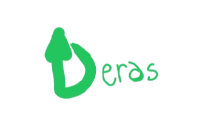

<h1 align="center">Deras</h1>

## Cos'è Deras?

Deras è un sistema operativo leggero e open source 
realizzato in **DrawNote**, letteralmente un blocco note.

se non hai DrawNote, installalo:

[]

>!NOTE
> L'app per iOS è stata eliminata e non è più disponibile.
