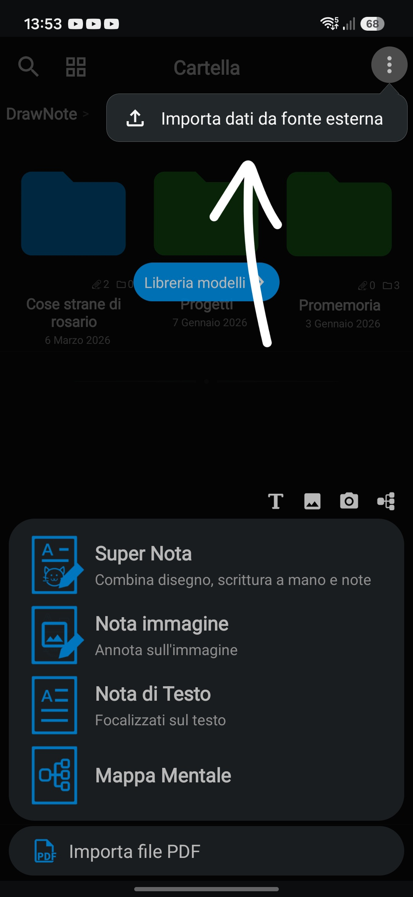

<h1 align="center">Deras</h1>

## Cos'è Deras?

Deras è un sistema operativo leggero e open source 
realizzato in **DrawNote**, letteralmente un blocco note.

se non hai DrawNote, installalo:

>[!NOTE]
> L'app per iOS è stata eliminata e non è più disponibile.

---

## Installazione

1. Scarica il file `dnotesp` o `dnotes`
2. Crea la cartella dove vuoi installare Deras.
3. Vai sul + e clicca i tre punti, e *importa da fonte esterna* 
4. Seleziona *importa file dati grezzi*
5. Seleziona il file scaricato
6. Imposta la cartella in cui dove vorrai installare Deras
7. Fai click su conferma 

Ora Deras è installato nella cartella `Deras` della cartella che hai scelto.

---

## Avviare Deras

Per avviare Deras, apri `.main` e fai click sul collegamento nota gigante, e andrai alla lockscreen.

---

## Informazioni sul progetto

Deras è iniziato a essere sviluppato a fine dicembre e lo sviluppo della prima versione è durato 2 anni... su un blocco note.
